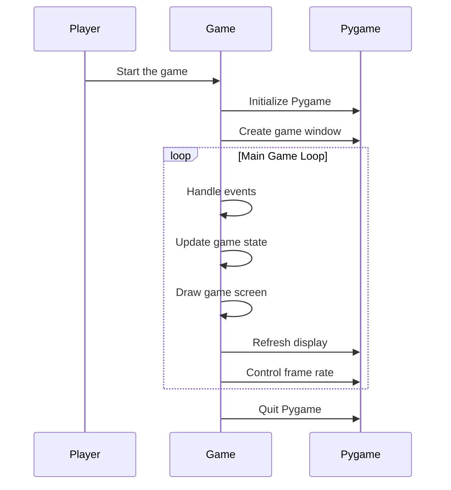

# PySnake Game

## Introduction
PySnake is a classic Snake game implemented in Python using the Pygame library. The objective of the game is to control the snake to eat food and grow in size while avoiding collisions with the walls and the snake's own body.

## Why I've Made This Project

I've made this project to be able to create a reinforcement learning agent that can play the game. I wanted to learn how to implement a reinforcement learning agent and how to use PyTorch.

## Prerequisites
Before you begin, ensure you have met the following requirements:
- Python 3.8 or higher
- Pygame 2.0 or higher

## Installation
To install the required dependencies, run the following command:
```bash
pip install pygame
```

## Structure of the Code
The project is organized into the following files and directories:

```
PySnake/
├── game/
│   ├── Game.py
│   ├── Snake.py
│   └── Food.py
├── assets/
│   └── snake_tileset_64x64.png
└── main.py
```

## Description of Files
- main.py: The entry point of the program. Initializes Pygame, creates a game instance, and runs the main game loop.
- game/Game.py: Contains the Game class, which manages the main game logic, including handling events, updating the game state, and drawing the game.
- game/Snake.py: Contains the Snake class, which manages the snake's behavior, including movement, direction changes, and growth.
- game/Food.py: Contains the Food class, which manages the food's appearance and positioning.

## How the Game Works

### Gameplay Description
The player controls a snake that moves around the game board. The snake grows in size each time it eats food. The game ends if the snake collides with the walls or with itself.

### Game Loop
1. Initialization: Initialize Pygame and create the game window.
2. Game Creation: Initialize an instance of the Game class.
3. Main Game Loop:
- Handle events (e.g., key presses, quit events).
- Update the game state (move the snake, check for collisions, handle food consumption).
- Draw the game screen (render the snake, food, and game board).
- Refresh the display and control the frame rate.
4. Game Termination: Quit Pygame when the game loop ends.

### Sequence Diagram
Here is a simplified sequence diagram of how the game works:



### Classes Overview

#### main.py
Initializes Pygame, sets up the display, and creates a Game instance.
Runs the main loop that drives the game.

#### Game Class (game/Game.py)
Manages the overall game logic, including handling user input, updating the game state, and rendering the game elements on the screen.

#### Snake Class (game/Snake.py)
Manages the behavior of the snake, including movement, direction changes, and growth.

#### Food Class (game/Food.py)
Manages the appearance and positioning of the food that the snake eats to grow.

### Assets
The assets directory contains the sprite sheet used for the snake and food graphics.

## Conclusion
This project provides a basic implementation of the classic Snake game using Python and Pygame. As I wrote in the introduction, I've made this project to be able to create a reinforcement learning agent that can play the game. But unfortunately, I tried to implement the agent, but I couldn't make it work. 
My problem was that to implement an agent, I have to know how to use PyTorch (framework that I wanted to use) and I have to know how to implement a neural network. I tried to learn PyTorch and neural networks, but I couldn't learn them in time.
So what my decision is to just push this small project and learn aside how to use PyTorch and how to implement a neural network.